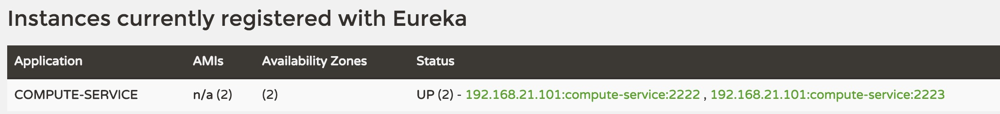

在上一篇《Spring Cloud构建微服务架构（一）服务注册与发现》中，我们已经成功创建了“服务注册中心”，实现并注册了一个“服务提供者：COMPUTE-SERVICE”。那么我们要如何去消费服务提供者的接口内容呢？

### Ribbon
`Ribbon`是一个基于HTTP和TCP客户端的负载均衡器。`Feign`中也使用`Ribbon`，后续会介绍`Feign`的使用。
`Ribbon`可以在通过客户端中配置的ribbonServerList服务端列表去轮询访问以达到均衡负载的作用。
当`Ribbon`与`Eureka`联合使用时，`ribbonServerList`会被`DiscoveryEnabledNIWSServerList`重写，扩展成从`Eureka`注册中心中获取服务端列表。同时它也会用`NIWSDiscoveryPing`来取代`IPing`，它将职责委托给`Eureka`来确定服务端是否已经启动。

下面我们通过实例看看如何使用`Ribbon`来调用服务，并实现客户端的均衡负载。

### 准备工作
* 启动Chapter-9-1-1中的服务注册中心：eureka-server
* 启动Chapter-9-1-1中的服务提供方：compute-service
* 修改compute-service中的server-port为2223，再启动一个服务提供方：compute-service

此时访问：http://localhost:1111/



可以看到COMPUTE-SERVICE服务有两个单元正在运行：

* 192.168.21.101:compute-service:2222
* 192.168.21.101:compute-service:2223

### 使用Ribbon实现客户端负载均衡的消费者
构建一个基本Spring Boot项目，并在pom.xml中加入如下内容：
```

<parent>
    <groupId>org.springframework.boot</groupId>
    <artifactId>spring-boot-starter-parent</artifactId>
    <version>1.3.5.RELEASE</version>
    <relativePath/> <!-- lookup parent from repository -->
</parent>

<dependencies>
    <dependency>
        <groupId>org.springframework.cloud</groupId>
        <artifactId>spring-cloud-starter-ribbon</artifactId>
    </dependency>
    <dependency>
        <groupId>org.springframework.cloud</groupId>
        <artifactId>spring-cloud-starter-eureka</artifactId>
    </dependency>
    <dependency>
        <groupId>org.springframework.boot</groupId>
        <artifactId>spring-boot-starter-web</artifactId>
    </dependency>
    <dependency>
        <groupId>org.springframework.boot</groupId>
        <artifactId>spring-boot-starter-test</artifactId>
        <scope>test</scope>
    </dependency>
</dependencies>

<dependencyManagement>
    <dependencies>
        <dependency>
	    <groupId>org.springframework.cloud</groupId>
	    <artifactId>spring-cloud-dependencies</artifactId>
	    <version>Brixton.RELEASE</version>
	    <type>pom</type>
	    <scope>import</scope>
	</dependency>
    </dependencies>
</dependencyManagement>

```
在应用主类中，通过`@EnableDiscoveryClient`注解来添加发现服务能力。创建`RestTemplate`实例，并通过`@LoadBalanced`注解开启均衡负载能力。

```java

@SpringBootApplication
@EnableDiscoveryClient
public class RibbonApplication {

    //通过ribbon开启客户端负载均衡
	@Bean
	@LoadBalanced
	RestTemplate restTemplate() {
		return new RestTemplate();
	}

	public static void main(String[] args) {
		SpringApplication.run(RibbonApplication.class, args);
	}

}

```

创建`ConsumerController`来消费`COMPUTE-SERVICE`的add服务。通过直接`RestTemplate`来调用服务，计算10 + 20的值。

```java

@RestController
public class ConsumerController {

    @Autowired
    RestTemplate restTemplate;

    @RequestMapping(value = "/add", method = RequestMethod.GET)
    public String add() {
        return restTemplate.getForEntity("http://COMPUTE-SERVICE/add?a=10&b=20", String.class).getBody();
    }

}

```
`application.properties`中配置eureka服务注册中心
```
spring.application.name=ribbon-consumer
server.port=3333

eureka.client.serviceUrl.defaultZone=http://localhost:1111/eureka/

```
启动该应用，并访问两次：http://localhost:3333/add

然后，打开`compute-service`的两个服务提供方，分别输出了类似下面的日志内容：

* 端口为2222服务提供端的日志：
```
2016-06-02 11:16:26.787  INFO 90014 --- [io-2222-exec-10] com.didispace.web.ComputeController      : /add, host:192.168.21.101, service_id:compute-service, result:30


```
* 端口为2223服务提供端的日志：
```
2016-06-02 11:19:41.241  INFO 90122 --- [nio-2223-exec-1] com.didispace.web.ComputeController      : /add, host:192.168.21.101, service_id:compute-service, result:30


```
可以看到，之前启动的两个compute-service服务端分别被调用了一次。到这里，我们已经通过`Ribbon`在客户端已经实现了对服务调用的均衡负载。

### Feign

`Feign`是一个声明式的`Web Service`客户端，它使得编写`Web Serivce`客户端变得更加简单。我们只需要使用`Feign`来创建一个接口并用注解来配置它既可完成。它具备可插拔的注解支持，包括`Feign`注解和`JAX-RS`注解。`Feign`也支持可插拔的编码器和解码器。`Spring Cloud`为`Feign`增加了对`Spring MVC`注解的支持，还整合了`Ribbon`和`Eureka`来提供均衡负载的HTTP客户端实现。

下面，通过一个例子来展现`Feign`如何方便的声明对上述computer-service服务的定义和调用。

创建一个Spring Boot工程，配置pom.xml，将上述的配置中的`ribbon`依赖替换成`feign`的依赖即可，具体如下：
```
<parent>
    <groupId>org.springframework.boot</groupId>
    <artifactId>spring-boot-starter-parent</artifactId>
    <version>1.3.5.RELEASE</version>
    <relativePath/> <!-- lookup parent from repository -->
</parent>

<dependencies>
    <dependency>
        <groupId>org.springframework.cloud</groupId>
        <artifactId>spring-cloud-starter-feign</artifactId>
    </dependency>
    <dependency>
        <groupId>org.springframework.cloud</groupId>
        <artifactId>spring-cloud-starter-eureka</artifactId>
    </dependency>
    <dependency>
        <groupId>org.springframework.boot</groupId>
        <artifactId>spring-boot-starter-web</artifactId>
    </dependency>
    <dependency>
        <groupId>org.springframework.boot</groupId>
        <artifactId>spring-boot-starter-test</artifactId>
        <scope>test</scope>
    </dependency>
</dependencies>

<dependencyManagement>
    <dependencies>
        <dependency>
	    <groupId>org.springframework.cloud</groupId>
	    <artifactId>spring-cloud-dependencies</artifactId>
	    <version>Brixton.RELEASE</version>
	    <type>pom</type>
	    <scope>import</scope>
	</dependency>
    </dependencies>
</dependencyManagement>

```

在应用主类中通过`@EnableFeignClients`注解开启`Feign`功能，具体如下：
```java

@SpringBootApplication
@EnableDiscoveryClient
@EnableFeignClients
public class FeignApplication {

	public static void main(String[] args) {
		SpringApplication.run(FeignApplication.class, args);
	}

}

```
定义`compute-service`服务的接口，具体如下：

```java

@FeignClient("compute-service")
public interface ComputeClient {

    @RequestMapping(method = RequestMethod.GET, value = "/add")
    Integer add(@RequestParam(value = "a") Integer a, @RequestParam(value = "b") Integer b);

}

```

* 使用@FeignClient("compute-service")注解来绑定该接口对应compute-service服务
* 通过Spring MVC的注解来配置compute-service服务下的具体实现

在web层中调用上面定义的`ComputeClient`，具体如下：
```java

@RestController
public class ConsumerController {

    @Autowired
    ComputeClient computeClient;

    @RequestMapping(value = "/add", method = RequestMethod.GET)
    public Integer add() {
        return computeClient.add(10, 20);
    }

}

```
`application.properties`中不用变，指定`eureka`服务注册中心即可，如：
```
spring.application.name=feign-consumer
server.port=3333

eureka.client.serviceUrl.defaultZone=http://localhost:1111/eurek

```
启动该应用，访问几次：http://localhost:3333/add
再观察日志，可以得到之前使用Ribbon时一样的结果，对服务提供方实现了均衡负载。

这一节我们通过`Feign`以接口和注解配置的方式，轻松实现了对`compute-service`服务的绑定，这样我们就可以在本地应用中像本地服务一下的调用它，并且做到了客户端均衡负载（通过ribbon的支持）。


