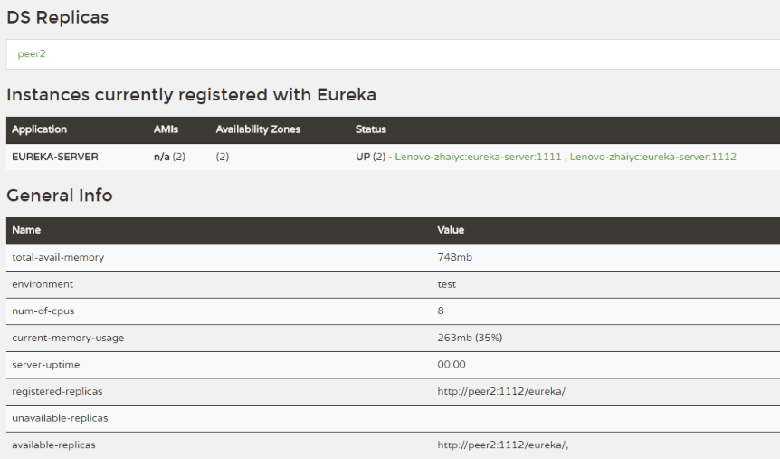
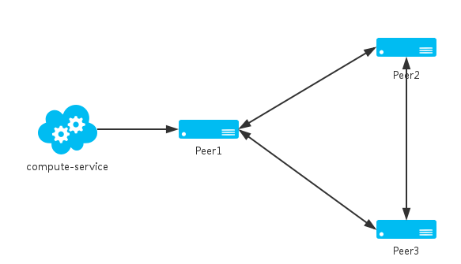
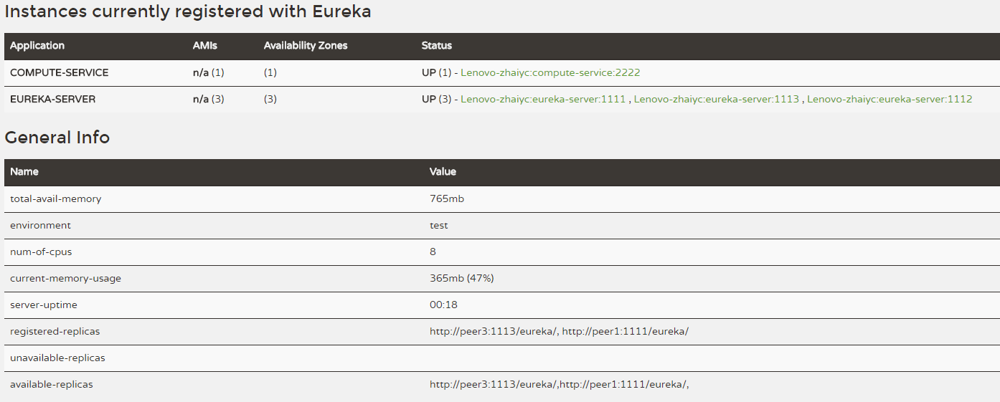

今天这篇主要就说说Eureka Server的高可用问题。

### 前言

在Spring Cloud系列文章的开始，我们就介绍了服务注册与发现，其中，主要演示了如何构建和启动服务注册中心`Eureka Server`，以及如何将服务注册到`Eureka Server`中，但是在之前的示例中，这个服务注册中心是单点的，显然这并不适合应用于线上生产环境，那么下面在前文的基础上，我们来看看该如何构建高可用的`Eureka Server`集群。

### Eureka Server的高可用

`Eureka Server`除了单点运行之外，还可以通过运行多个实例，并进行互相注册的方式来实现高可用的部署，所以我们只需要将`Eureke Server`配置其他可用的serviceUrl就能实现高可用部署。

下面以[Chapter1-1-1](https://github.com/dyc87112/SpringCloud-Learning/tree/master/Chapter1-1-1)中的eureka-server为基础，对其改造，构建双节点的服务注册中心。

* 创建`application-peer1.properties`，作为peer1服务中心的配置，并将serviceUrl指向peer2
```

spring.application.name=eureka-server
server.port=1111
eureka.instance.hostname=peer1

eureka.client.serviceUrl.defaultZone=http://peer2:1112/eureka/

```
创建`application-peer2.properties`，作为peer2服务中心的配置，并将serviceUrl指向peer1

```
spring.application.name=eureka-server
server.port=1112
eureka.instance.hostname=peer2

eureka.client.serviceUrl.defaultZone=http://peer1:1111/eureka/

```
* 在`/etc/hosts`文件中添加对`peer1`和`peer2`的转换

```
127.0.0.1 peer1
127.0.0.1 peer2

```
通过 `spring.profiles.active` 属性来分别启动`peer1`和`peer2`

```
java -jar eureka-server-1.0.0.jar --spring.profiles.active=peer1
java -jar eureka-server-1.0.0.jar --spring.profiles.active=peer2

```
* 此时访问`peer1`的注册中心：`http://localhost:1111/`，如下图所示，我们可以看到`registered-replicas`中已经有`peer2`节点的`eureka-server`了。同样地，访问`peer2`的注册中心：`http://localhost:1112/`，能看到`registered-replicas`中已经有`peer1`节点，并且这些节点在可用分片（`available-replicase`）之中。我们也可以尝试关闭`peer1`，刷新`http://localhost:1112/`，可以看到`peer1`的节点变为了不可用分片（`unavailable-replicas`）。



### 服务注册与发现

在设置了多节点的服务注册中心之后，我们只需要简单修改服务配置，就能将服务注册到`Eureka Server`集群中。我们以`Chapter1-1-1`中的`compute-service`为基础，修改`application.properties`配置文件：

```
spring.application.name=compute-service
server.port=2222

eureka.client.serviceUrl.defaultZone=http://peer1:1111/eureka/,http://peer2:1112/eureka/

```

上面的配置主要对`eureka.client.serviceUrl.defaultZone`属性做了改动，将注册中心指向了之前我们搭建的`peer1`与`peer2`。

下面，我们启动该服务，通过访问`http://localhost:1111/`和`http://localhost:1112/`，可以观察到`compute-service`同时被注册到了`peer1`和`peer2`上。若此时断开`peer1`，由于`compute-service`同时也向`peer2`注册，因此在`peer2`上其他服务依然能访问到`compute-service`，从而实现了高可用的服务注册中心。


### 深入理解

虽然上面我们以双节点作为例子，但是实际上因负载等原因，我们往往可能需要在生产环境构建多于两个的`Eureka Server`节点。那么对于如何配置`serviceUrl`来让集群中的服务进行同步，需要我们更深入的理解节点间的同步机制来做出决策。

`Eureka Server`的同步遵循着一个非常简单的原则：只要有一条边将节点连接，就可以进行信息传播与同步。什么意思呢？不妨我们通过下面的实验来看看会发生什么。

* 场景一：假设我们有3个注册中心，我们将`peer1`、`peer2`、`peer3`各自都将`serviceUrl`指向另外两个节点。换言之，`peer1`、`peer2`、`peer3`是两两互相注册的。启动三个服务注册中心，并将`compute-service`的`serviceUrl`指向`peer1`并启动，可以获得如下图所示的集群效果。



访问`http://localhost:1112/`，可以看到3个注册中心组成了集群，`compute-service`服务通过`peer1`同步给了与之互相注册的`peer2`和`peer3`。



通过上面的实验，我们可以得出下面的结论来指导我们搭建服务注册中心的高可用集群：

* 两两注册的方式可以实现集群中节点完全对等的效果，实现最高可用性集群，任何一台注册中心故障都不会影响服务的注册与发现

